BotMan
-----------

### Rewrite of [BotMan.py (legacy)](https://github.com/code-cecilia/botman.py-legacy) using py-cord, made with ❤️, and a bit of Python.

## Top.gg Page


[Link to page](https://top.gg/bot/845225811152732179)

## Sections

- [Config Structure](#config-structure)
- [Dependencies](#dependencies)
- [Misc Dependencies](#misc-dependencies)
- [Dependencies Used By Each Cog](#dependencies-used-by-each-cog)
- [Adding Cogs to Blacklist](#adding-cogs-to-blacklist)
- [Where To Get Details for Config](#where-to-get-details-for-config)
- [Credits](#credits)

### Config Structure

```json
{
  "bot_token": "",
  "bot_owner_id": 123456789,
  "bot_prefix": "",
  "bot_description": "The coolest Python bot on the planet!",
  "bot_stream": true,
  "bot_stream_url": "https://www.youtube.com/watch?v=dQw4w9WgXcQ",
  "bot_log_channel": 123456789,
  "auto_backup": true,
  "max_backups": 10,
  "blacklisted_cogs": [
    "cog1",
    "cog2"
  ],
  "imgflip_username": "",
  "imgflip_password": "",
  "weather_api_key": "",
  "spotify_client_id": "",
  "spotify_client_secret": "",
  "topgg_token": "",
  "reddit_username": "",
  "reddit_password": "",
  "reddit_client_id": "",
  "reddit_client_secret": "",
  "currency_api_key": "",
  "openrobot_api_key": "",
  "tesseract_custom_path": "",
  "tesseract_tessdata_path": ""
}
```

### Dependencies

This project uses a list of dependencies which can be found in the [requirements file](requirements.txt).
You can install them using the following command:

```shell
# macOS
python3 -m pip install -r requirements.txt

# Windows
python -m pip install -r requirements.txt

# Linux (Works on my Ubuntu machine, I don't really know about other distros)
python3 -m pip install -r requirements.txt
```

In case you are hosting the bot in an obscure environment, like a very old jailbroken iPad _(don't.)_, you might find
that
not all dependencies can be installed on your machine.
In that case, you can install the available dependencies manually,
then add the cogs which use the unavailable dependencies to the `blacklisted_cogs` array in the config.
A list of all dependencies each Cog uses can be found [here](#dependencies-used-by-each-cog).<br>
You can install a dependency manually by running the following command:

```shell
# macOS
python3 -m pip install <dependency>

# Windows
python -m pip install <dependency>

# Linux (Works on my Ubuntu machine, I don't really know about other distros)
python3 -m pip install <dependency>
```

### Misc Dependencies

Apart from the dependencies mentioned in the `requirements.txt` file, there are a few dependencies which need to be
installed manually.

- `topggpy`
  If you are going to use the `topgg_commands` cog, you need to install the `topggpy` dependency.
  ```shell
  # macOS
  python3 -m pip install topggpy

  # Windows
  python -m pip install topggpy
  
  # Linux (Works on my Ubuntu machine, I don't really know about other distros)
  python3 -m pip install topggpy
  ```

- `tesseract-ocr`
    - For Linux:
  ```shell
  # Works on my Ubuntu machine, I don't really know about other distros
  sudo apt-get install tesseract-ocr
  # Install all available languages
  sudo apt-get install tesseract-ocr-all
  ```
    - For macOS:
  ```shell
  # You need Homebrew for this
  brew install tesseract
  # Install all available languages
  brew install tesseract-lang
  ```    
    - For Windows
  ```
  # There is no official installer, but this one works just fine
  Download from https://github.com/UB-Mannheim/tesseract/wiki
  ```

- `neofetch` (not very important, but nice to have)
    - [Installation Instructions](https://github.com/dylanaraps/neofetch/wiki/Installation)

### Dependencies Used by each Cog

Common dependencies to every Cog:

- `py-cord`

Dependencies used by:

| Cog                 | Dependencies                                       |
|---------------------|----------------------------------------------------|
| bot_internal_events | aiohttp, requests                                  |
| botinfo             | aiohttp                                            |
| covid               | aiohttp                                            |
| currency            | aiohttp                                            |
| funzies             | aiohttp                                            |
| gaems               | aiohttp                                            |
| image_processing    | aiohttp, pillow, pytesseract, numpy, opencv-python |
| info                | None                                               |
| links               | None                                               |
| logging             | None                                               |
| madlibs             | aiohttp                                            |
| memes               | aiohttp                                            |
| misc                | aiohttp                                            |
| openrobot           | aiohttp                                            |
| owner_only          | aiohttp, jishaku                                   |
| roleplay            | aiohttp                                            |
| server_setup        | None                                               |
| spotify             | aiohttp, spotipy                                   |
| time_commands       | aiohttp                                            |
| topgg_commands      | topggpy (needs to be installed manually)           |
| translate           | googletrans                                        |
| weather             | aiohttp                                            |
| websurf             | aiohttp                                            |
| wikipedia           | aiohttp                                            |

### Adding Cogs to Blacklist

If you want to add a cog to the blacklist, add it to the `blacklisted_cogs` array in the config.

For example, if you don't want the `owner_only.py` to be loaded, add `owner_only` to the `blacklisted_cogs` array.
A sample array would be something like

```json
["owner_only", "spotify", "covid"]
```

### Where To Get Details for Config

#### `bot_token`

- Get to the [Discord Developer Portal](https://discord.com/developers/applications) and make a new application.
- Make the application a bot
- Enable Privileged Intents
- Copy Token

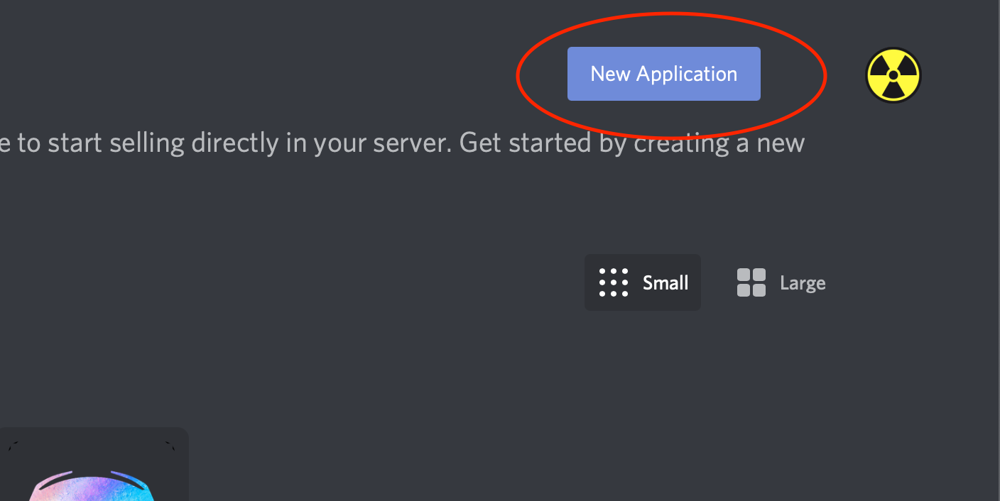
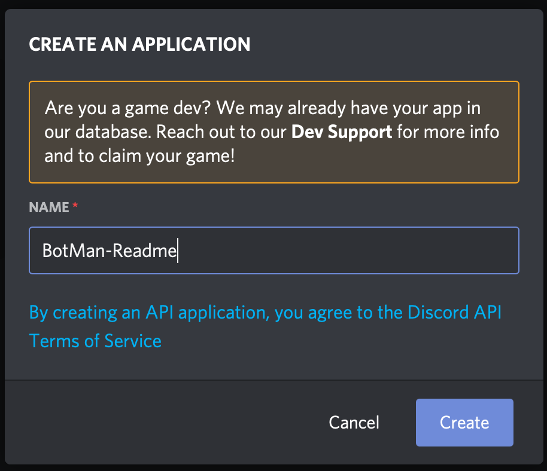

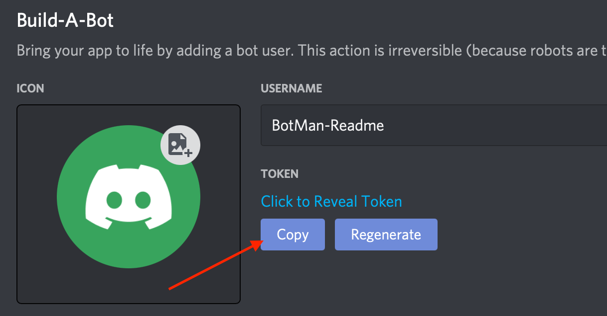

#### `bot_owner_id`

- Go to the Discord app's settings
- Click on the "Advanced" tab and enable Developer Mode
- Right-click on your profile picture in any of your messages, click "Copy ID"

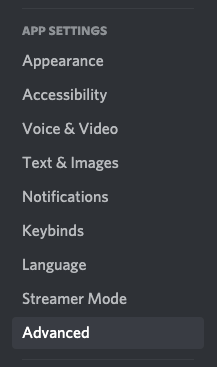
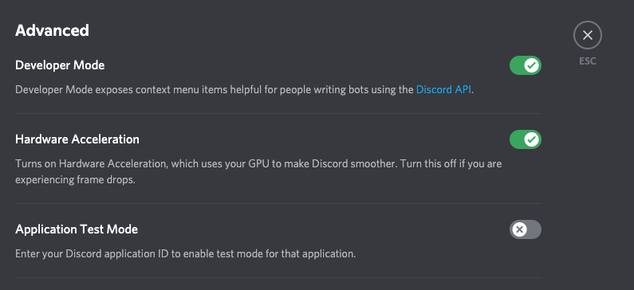


#### `bot_prefix`

Set this to whatever you want your bot's prefix to be. Something like `$` or `!`.

#### `bot_description`

Set this to whatever you want your bot's description to be. This will be shown in the help command.

#### `bot_stream`

If you want your bot to have a Streaming activity status, set this to `true`. Otherwise, set it to `false`.

#### `bot_stream_url`

Only applicable if you have `bot_stream` set to `true`. Set this to the URL of the stream.
You can pass in a valid Twitch or YouTube URL. _(Perfect chance for a Rickroll)_

#### `bot_log_channel`

Set this to the ID of the channel you want your bot to log to.
Follow same instructions `bot_owner_id`, but right-click on a channel instead, to get the ID.

#### `blacklisted_cogs`

Refer [This section](#adding-cogs-to-blacklist).

#### `imgflip_username`

Sign up for an account at [Imgflip](https://imgflip.com/signup).

#### `imgflip_password`

Same as [imgflip_username](#imgflip_username).

#### `weather_api_key`

- Get the free plan from [OpenWeatherMap](https://openweathermap.org/price).
- After getting the key, you should find your API key [here](https://home.openweathermap.org/api_keys).

#### `spotify_client_id`

- Log in to the [Spotify Developer Portal](https://developer.spotify.com/dashboard/applications) and create a new
  application.
- Copy the Client ID

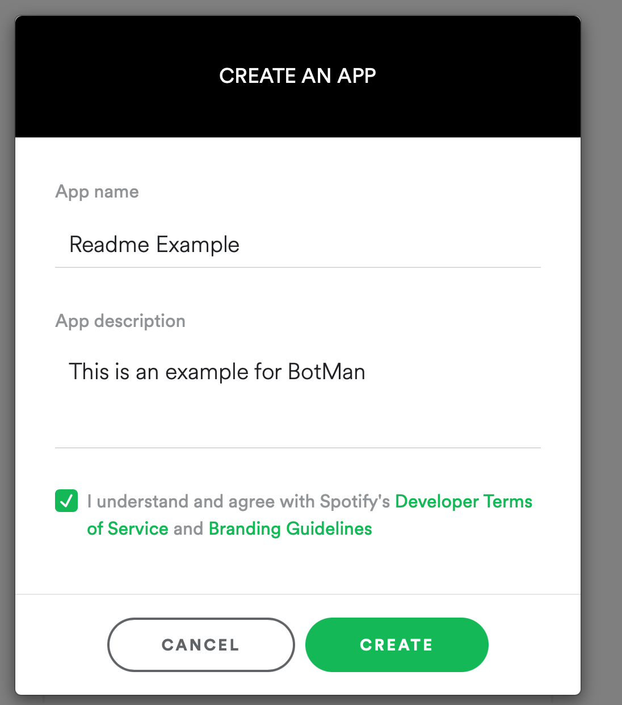
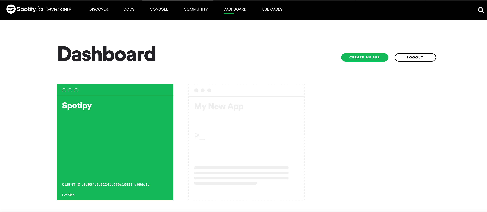
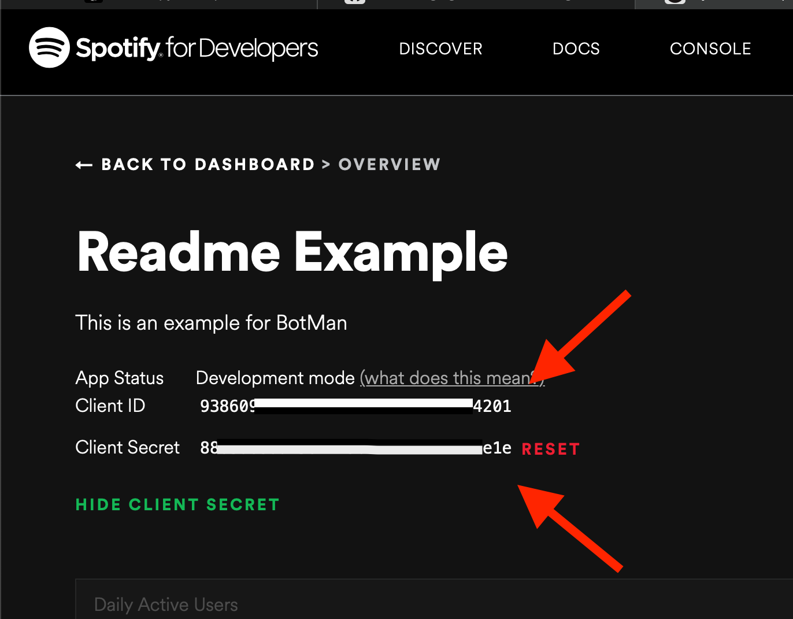

#### `Spotify_client_secret`

Same as [spotify_client_id](#spotify_client_id), except you copy the Client Secret instead.

#### `topgg_token`

**Warning: Only applicable if you have a bot on top.gg which you are an owner of.**

**Note: You will need to have installed the `topggpy` package. Refer [this section](#misc-dependencies) for
instructions.**

- Click on `Edit` in the Creator Controls pane in your bot's page on top.gg
- Go to the `Webhooks` tab
- Reveal token, copy it

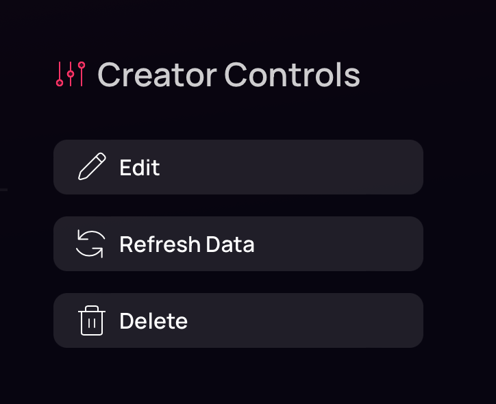
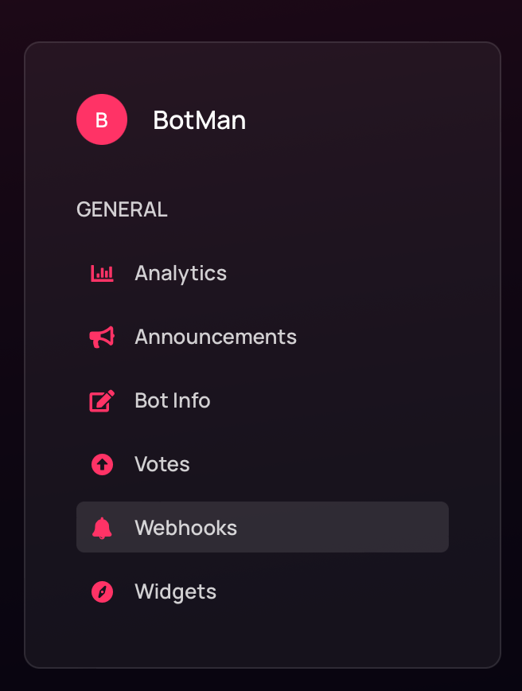
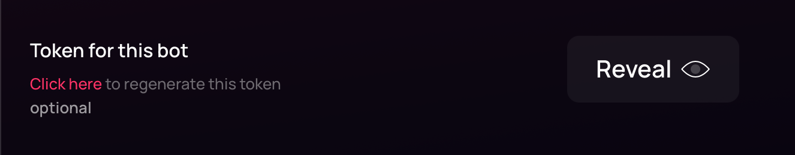

**Warning**: The bot's server count on top.gg will be updated with the server count of your instance of this bot.

#### `reddit_username`

Go to [Reddit](https://www.reddit.com), and make a new account (You can use an existing account too)

The first step you need to do is turn on dark mode, because that's what cool people do 😎

Now go to the [Reddit Applications page](https://www.reddit.com/prefs/apps/), and create an application


What you need to do now, is to enter these details

- Name - A name for your application
- Check the `script` button
- set `about url` and `redirect url` as `https://localhost:8080` (It's what I do. If you know what you're doing, feel
  free to mess around.)
- Click on `Create app`

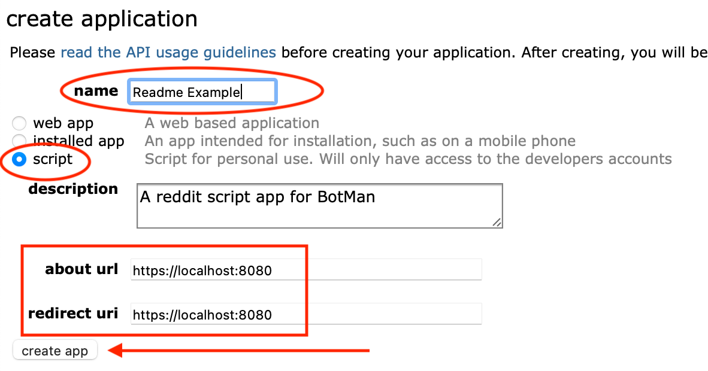

Now, you'd see an entry for your application **above** the portion of the screen where you entered the details.

You can get the Client ID and Client Secret from these entries.
The username and password are the same as you used for your Reddit account.

#### `reddit_password`

Same as [reddit_username](#reddit_username)

#### `reddit_client_id`

Same as [reddit_username](#reddit_username)

#### `reddit_client_secret`

Same as [reddit_username](#reddit_username)

#### `currency_api_key`

Get the free API Key from [CurrencyConvertApi](https://free.currencyconverterapi.com/).

#### `openrobot_api_key`

Go to [OpenRobot's Documentation](https://api.openrobot.xyz/api/docs#section/Authentication) and follow the
instructions.
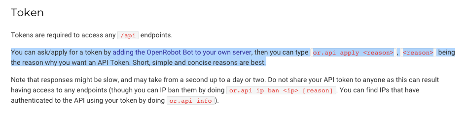

If you are not able to procure the API Key, you can add the `openrobot` cog to the `blacklisted_cogs` list.

# Credits

- [Discord.py](https://github.com/Rapptz/discord.py) and [PyCord](https://github.com/Pycord-Development/pycord) for
  obvious reasons
- A lot of friends who helped bring this project to where it is now.
- Special mention to [CorpNewt](https://github.com/CorpNewt) for [CorpBot.py](https://github.com/corpnewt/CorpBot.py/)
  from where I got ideas for _quite a few_ commnds
